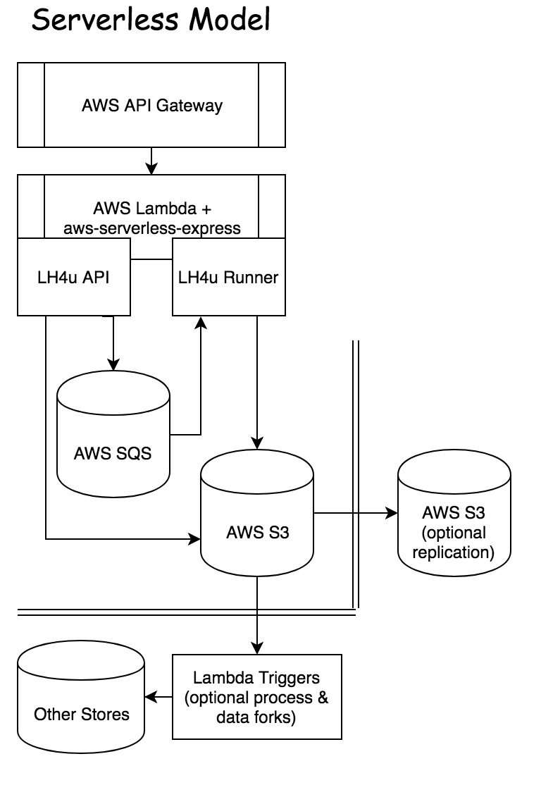

# lighthouse4u-lambda

This is a sample project that can be cloned or forked to bring the power of
[Lighthouse4u](https://github.com/godaddy/lighthouse4u) and
[Google Lighthouse](https://github.com/GoogleChrome/lighthouse) to AWS Lambda.

## Architecture

Designed to be as simple as possible and embrace the serverless model, pay only for what you use, with near limitless scale.

AWS services required:

* Lambda - A single Lambda will be able to run Google Lighthouse jobs and supporting the Lighthouse4u
  UI+API. The consolidation is to keep things simple and reduce chance of cold starts, but can
  easily be broken into two Lambda's if desired.
* SQS - Simple Queue is where all Lighthouse jobs are stored until completed, and the Lambda
  will consume these events directly via triggers. More on this later.
* S3 - All reads, writes, and (limited) queries leverage S3 as the primary store.
* API Gateway - Attached to the Lambda to support the Lighthouse4u API+UI.

## Prerequisites

* AWS Account
* AWS CLI installed locally, and configured to point to your AWS Account
* Docker installed locally
* Clone (or fork) this repo

## Setup

Below are a set of one-time tasks to configure your environment. Be sure all services reside in the same
region.

* Create a Standard [Simple Queue](https://console.aws.amazon.com/sqs/home) with a default
  visibility timeout of 1 minute. Name it what you like, such as `lh4u`. You'll need the queue URL later.
* Create a [S3 Bucket](https://s3.console.aws.amazon.com/s3/home). Name it what you like, such as `lh4u`.
  No other steps are required on the bucket unless you wish to auto-delete older objects via
  Lifecycle Management.
* Create a [Lambda Function](https://console.aws.amazon.com/lambda/home). `1.5GB` is recommended for optimal
  reliability. Name it what you like, such as
  `lighthouse4u-lambda`. Don't worry about deployment yet, just getting the shell in place.
* Attach your SQS queue to your Lambda via Trigger in your Lambda settings. This will forward any SQS
  messages to your Lambda.
* Create a REST [API Gateway](https://console.aws.amazon.com/apigateway/home). Name it what you like, such as
  `lighthouse4u-lambda-api`.
* Create a Resource under your API Gateway, configured as a Proxy Resource, with resource path of `{proxy+}`.
* Under your new API Gateway Resource you'll create a method of type `ANY` and attach your Lambda via
  the Lambda Function Proxy option.
* Repeat the previous step by adding the same `ANY` method to the root of the API Gateway.
* Deploy your API Gateway, and create a new stage if your first time deploying this API. The name can be
  anything, such as the environment, ala `production`.

**Note:** Configuring permissions is outside the scope of these instructions. But effectively you'll need
to permit your Lambda to read/write to S3 and SQS.

At this point everything is wired up and ready for deployment. Optionally you may opt to attach your own
custom domain to avoid having to use the ugly API Gateway auto-generated URL, ala
`https://983dsdf.execute-api.us-east-1.amazonaws.com/production/`.

## Configuration

Edit your `config/defaults.json` file (or environment file if you wish to use `NODE_ENV` instead).

* Add your region name to `store.options.region` and `queue.options.region` configurations.
* Copy/paste your SQS URL to `queue.options.queueUrl`.
* Copy/paste your S3 Bucket name to `store.options.bucket`.
* Above are only the required settings. There are
  [numerous options](https://github.com/godaddy/lighthouse4u#configuration-options) if you wish
  to take advantage/tune any other Lighthouse4u or Google Lighthouse options.

If you wish to deploy from your local enivornment (faster), edit your `package.json` file:

* Update the `deploy:local-to-s3` script and add the desired S3 bucket in place of `DEPLOYMENT_BUCKET`.
  You can reuse your LH4U bucket if you prefer.
* Update the `deploy:s3-to-lambda` script and add the previous S3 bucket in place of `DEPLOYMENT_BUCKET`.
* Update the `deploy:s3-to-lambda` script and replace `LAMBDA_FUNCTION` with the name of your Lambda.

## Deployment

Anytime you make a change to `config` or code, you'll need to:

* Via command line run `npm run build`. This will build your `node_modules` folder using a
  Lambda-compatible Docker image.
* Via command line run `npm run deploy`. This will deploy the zip file generated from the
  previous step to your S3 deployment bucket, and deploy that file to your Lambda. This step
  will only work if you completed the deployment configuration steps above. Otherwise you
  can manually upload the `lighthouse4u-lambda.zip` found in the root directly in your Lambda
  UI Console.
